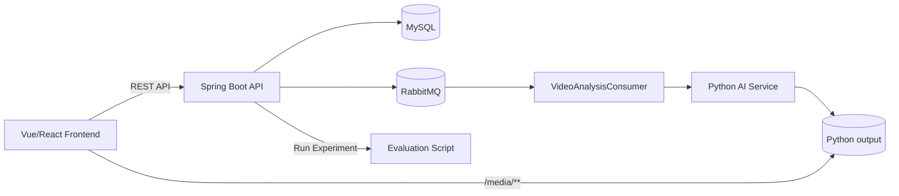
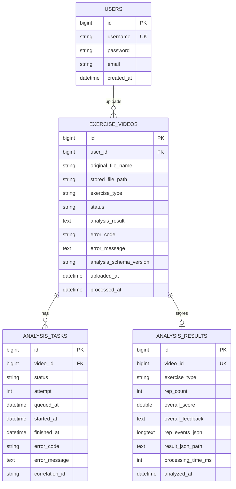

# 系统架构与数据模型

## 技术架构图

## E-R 图

## 核心流程（闭环）
1. 用户上传视频到 Spring Boot。
2. 后端创建任务并投递 RabbitMQ（若 MQ 不可用则自动降级到本地异步执行）。
3. Python AI 服务分析视频，输出 `rep_count`、`rep_events`、`report_images`、`tips`。
4. Java 将 Python JSON 原样入库并更新任务状态。
5. 前端轮询 `/api/videos/{id}/analysis`：
   - `202`：处理中
   - `200`：展示报告
   - `500/409`：显示失败信息
